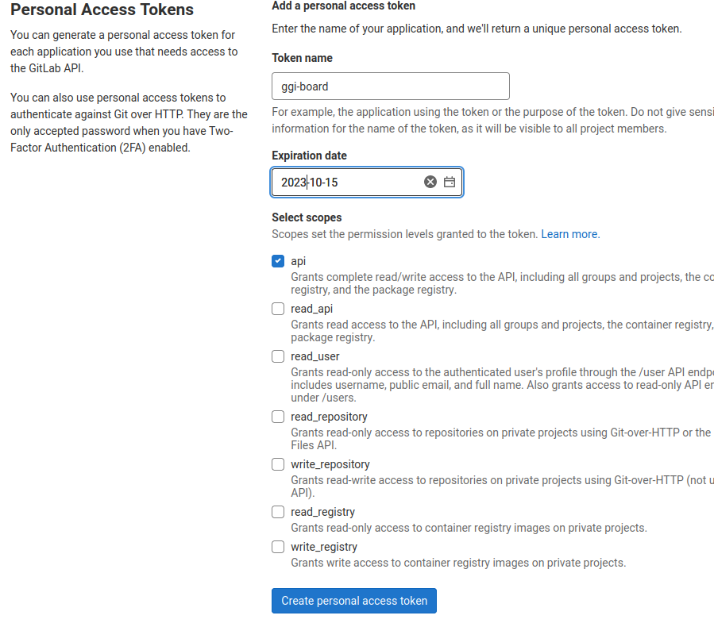
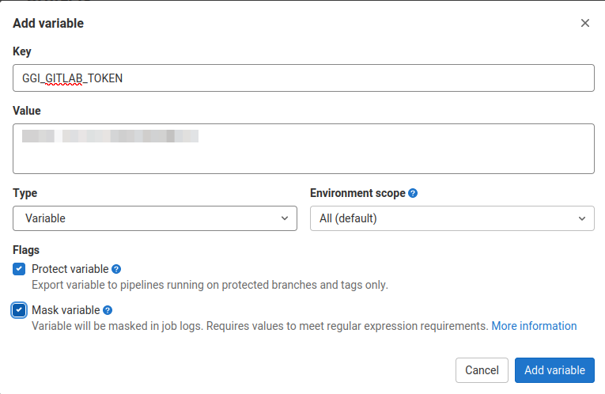

# Welcome

This the home is your own Good Governance Initiative.

Once set up (see below), you can find the published website at [GGI_PAGES_URL].


## Setup

1. Create an empty project on your target GitLab instance.
``


2. Clone the [my-ggi-board repository](https://gitlab.ow2.org/ggi/my-ggi-board) to your new project.

To do so, clone the my-ggi-board repository locally, add the new project's reference to the remotes, and push it to the new remote:
```
$ git clone https://gitlab.ow2.org/ggi/my-ggi-board
$ git remote add my-ggi git@gitlab.com:bbaldassari/my-ggi.git
$ git push my-ggi
```

Example:
```
$ git remote -v
my-ggi	git@gitlab.com:bbaldassari/my-ggi.git (fetch)
my-ggi	git@gitlab.com:bbaldassari/my-ggi.git (push)
origin	https://gitlab.ow2.org/ggi/my-ggi-board (fetch)
origin	https://gitlab.ow2.org/ggi/my-ggi-board (push)
$
$ git push my-ggi
Énumération des objets: 186, fait.
Décompte des objets: 100% (186/186), fait.
Compression par delta en utilisant jusqu'à 8 fils d'exécution
Compression des objets: 100% (144/144), fait.
Écriture des objets: 100% (186/186), 160.42 Kio | 26.74 Mio/s, fait.
Total 186 (delta 17), réutilisés 182 (delta 17), réutilisés du pack 0
remote: Resolving deltas: 100% (17/17), done.
To gitlab.com:bbaldassari/my-ggi.git
 * [new branch]      main -> main
$
```

3. Create an access token (Project settings > Access Tokens) with the `api` privilege and with role `Maintainer`. Remember it, you will never see it see it again.
  - In case the instance admin has disabled the _project_ access token, you can use an _account_ access token, although we recommend creating a dedicated account for security purposes in that case. Go to Preferences > Access Tokens and create the token from there.


4. Edit the file in `conf/ggi_deployment.json`, and set the variables `gitlab_url` and `gitlab_project`

5. Create a CI/CD env variable: go to Settings > CI/CD > Variables, then add a variable named `GGI_GITLAB_TOKEN` and set the access token as the value. Make it `Protected` and `Masked`.



5. Run the deploy script: `python3 scripts/ggi_deploy.py --activities --board`. That will:
  - Create labels, activities, board.
  - Setup the static website configuration.
  - Replace the URL in the README.

6. Commit your changes.

7. Push to the local gitlab instance on the `main` branch. That will:
  - Create a pipeline and gitlab page thanks to the `.gitlab_ci.yml` file.
  - Execute the ggi_update_website script, updating the website's content.
  - Publish the gitlab page.

## Notes

* Prerequisites for ptyhon are registered in `requirements.txt`. You are encouraged to create a virtual environment to execute the scripts, althought it is not required.
* GitLab CE doesn't allow to create Boards through the API.


## Structure

```
conf/
├── ggi_activities_metadata.json
└── ggi_deployment.json
scripts/
└── ggi_deploy.py
README.md
```


## Testing

The ggi_test_scenario.py script takes as argument a GitLab instance URL and a project ID, executes the creation scripts and then checks that everything is in its right place.
